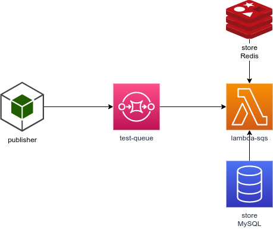

# template-serverless-lambda-python - Lambda SQS
Template for build flexible SQS processor with AWS Lambda.

[](https://github.com/PyCQA/pylint)
[](https://www.python.org/dev/peps/pep-0008/)
[](https://sonarcloud.io/summary/new_code?id=madeiramadeirabr_template-serverless-lambda-python)
[](https://sonarcloud.io/summary/new_code?id=madeiramadeirabr_template-serverless-lambda-python)
[](https://sonarcloud.io/summary/new_code?id=madeiramadeirabr_template-serverless-lambda-python)

## Tutorial
Video with the explanation about the project:
https://drive.google.com/file/d/1igaBUw2bmK9wTiolcpuyh1l8I1iAQQDb/view?usp=sharing

## Service Architecture
Diagrams with application usage of this architecture.

More details [here](https://drive.google.com/file/d/112om-id0zfd8qGd0Q4kTaoIwIgwx6DGJ/view?usp=sharing).

### Cloud Architecture
Example of the architecture running on AWS Cloud.



### Docker Architecture
Exemple of the architecture running with docker.


## General Service Routes Architecture
There are no routes for this project.

# Prerequisites
- Python >=3.6
- docker
- docker-compose
- python-dotenv
- jsonformatter
- requests
- pytz
- redis
- pyyaml
- apispec
- marshmallow
- Flask

## Features
- Docker-compose 
- Localstack
- SQS Integration
- Flask
- MySQL
- Redis

## Details about requirements files
### requirements.txt
Collection of common application modules, light modules.

### requirements-vendor.txt
Collection of specific application modules, heavy modules that can be converted to layers if necessary.

### requirements-tests.txt
Collection of specific test application modules.


## Installation
### Installing AWS CLI
Documentation:
https://docs.aws.amazon.com/pt_br/cli/latest/userguide/install-cliv2.html

Execute the follow command:
```bash
apt install python38-env
apt install awscli
apt install zip
app install pip
```
Execute the follow command:
```bash
aws configure
```

### Installing python venv support
Execute the follow command:
```bash
apt install python38-env
```

### Running Locally
To create the `venv` and install the modules execute:
```bash
./scripts/venv.sh
```
#### Running the app
Execute the follow command:
```bash
./scripts/flask/run-local.sh
```
### Running via docker
To execute the build:
```bash
./scripts/runenv.sh --build
```

Execute the follow command:
```bash
./scripts/runenv.sh
```

### Recovering the environment in error cases
Execute the follow command:
```bash
./scripts/fixenv.sh
```

## Automation scripts information
Bellow we describe the usage of the automation scripts.
These kebab case scripts helps the developer in general tasks.

### General scripts
Kebab case script to help the developer in general tasks.

| Script                      | Description                                                                       | Context           |
|-----------------------------|-----------------------------------------------------------------------------------|-------------------|
| autopep8.sh                 | Execute the code-lint for pep8                                                    | Codelint          |
| boot.sh                     | Boot the application during de container execution                                | Local boot        |
| boot-db.sh                  | Boot the data for the database                                                    | Local boot        |
| boot-queues.sh              | Boot the queues of the application in the localstack                              | Local boot        |
| boot-validate-connection.sh | Check if localstack is ready to connect                                           | Local boot        | 
| clean-env.sh                | Clean the ./vendor folder                                                         | Local install     |
| fixenv.sh                   | In some cases where the network are deleted, you can fix the container references | Local install     |
| install.sh                  | Script to install the dependencies                                                | Local install     |
| install-local.sh            | Script to install the dependencies in the ./vendor folder                         | Local install     |
| openapi.sh                  | Script to generate the openapi.yaml                                               | CI/CD pipeline    |
| preenv.sh                   | Script to execute the pre build commands                                          | Local boot        |
| pylint.sh                   | Script to execute the pylint analysis                                             | Local development |
| runenv.sh                   | Script to start the project locally                                               | Local development |
| testenv.sh                  | Script to run the environment with focus in the component tests                   | Local development |
| venv.sh                     | Script to install the dependencies in the venv folder                             | Local install     |
| venv-exec.sh                | Script to execute scripts to install content inside the venv                      | Local install     |
| zip.sh                      | Generate a zip file with the application content                                  | Other             |

### Docker scripts
Helper scripts to do tasks for docker context;
### Flask scripts
Helper scripts to run flask locally, not inside a docker container;
### Localstack scripts
Helper scripts to run commands over Localstack resources like S3, SQS, Lambda, etc;
### Migrations scripts
Helper scripts to execute migrations;
### OpenApi scripts
Helper scripts to generate openapi schemas and specifications;
### Tests scripts
Helper scripts to execute tests and generate reports;
## Samples
See the project samples in this folder [here](samples).

## Running tests
To run the unit tests of the project you can execute the follow command:

First you need install the tests requirements:
 ```bash
 ./scripts/venv-exec.sh ./scripts/tests/install-tests.sh 
 ```

 
### Unit tests:
Executing the tests:
 ```bash
./scripts/venv-exec.sh ./scripts/tests/unit-tests.sh
 ``` 
Executing a specific file:
 ```bash
./scripts/venv-exec.sh ./scripts/tests/unit-tests.sh /tests/unit/test_app.py
 ```
### Components tests:
Start the docker containers:
 ```bash
./scripts/testenv.sh
```

Executing the tests:
 ```bash
./scripts/venv-exec.sh ./scripts/tests/component-tests.sh
```
Executing a specific file:
 ```bash
./scripts/venv-exec.sh ./scripts/tests/component-tests.sh /tests/component/test_app.py
 ```
### Integration tests:
Copy the file `env/integration.env.example` to 
`env/integration.env` and edit it with de staging parameters.

Executing the tests:
 ```bash
./scripts/venv-exec.sh ./scripts/tests/integration-tests.sh
```
Executing a specific file:
```bash
./scripts/venv-exec.sh ./scripts/tests/integration-tests.sh /tests/integration/test_app.py
```

### All tests:
Executing the tests:
```bash
 ./scripts/venv-exec.sh ./scripts/tests/tests.sh 
 ```

## Generating coverage reports
To execute coverage tests you can execute the follow commands:

### Unit test coverage:
Execute the follow command:
```bash
./scripts/venv-exec.sh ./scripts/tests/unit-coverage.sh
``` 

### Component test coverage:
Start the docker containers:
```bash 
./scripts/testenv.sh
```

Execute the follow command:
```bash 
./scripts/venv-exec.sh ./scripts/tests/component-coverage.sh
```

### Integration test coverage:

Copy the file `env/integration.env.example` to 
`env/integration.env` and edit it with de staging parameters.

Execute the follow command:
```bash 
./scripts/venv-exec.sh ./scripts/tests/integration-coverage.sh
```
> Observation:

The result can be found in the folder `target/*`.


## License
See the license: [LICENSE.md](LICENSE.md).

## Contributions
* Anderson de Oliveira Contreira [andersoncontreira](https://github.com/andersoncontreira)

## IDE configuration
* For docstring syntax please use the `reStructuredText`
* For line limit use 100 chars as defined by PEP8

## Pylint
To execute the pylint in the sourcecode of the project, execute the follow command:
```bash 
./scripts/pylint.sh
```
Or:

```bash 
./scripts/pylint.sh ./app.py
```

## AutoPEP8
To execute the autopep8 in the sourcecode of the project, execute the follow command:
```bash 
./scripts/autopep8.sh
```
Or:

```bash 
./scripts/autopep8.sh ./app.py
```